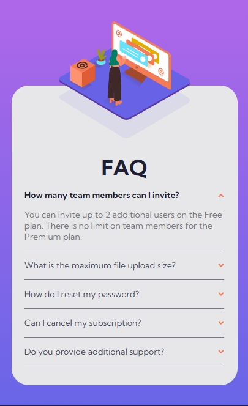
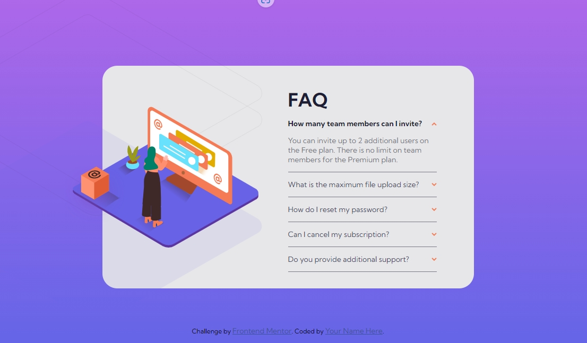

# Frontend Mentor - FAQ accordion card solution

This is a solution to the [FAQ accordion card challenge on Frontend Mentor](https://www.frontendmentor.io/challenges/faq-accordion-card-XlyjD0Oam).

Frontend Mentor challenges help you improve your coding skills by building realistic projects.

## Table of contents

-   [Overview](#overview)
    -   [The challenge](#the-challenge)
    -   [Screenshot](#screenshot)
    -   [Links](#links)
-   [My process](#my-process)
    -   [Built with](#built-with)
    -   [What I learned](#what-i-learned)

## Overview

### The challenge

Users should be able to:

-   View the optimal layout for the component depending on their device's screen size
-   See hover states for all interactive elements on the page
-   Hide/Show the answer to a question when the question is clicked

### Screenshot

-   Mobile



-Desktop



### Links

-   Solution URL: [fontend mentor solution](https://www.frontendmentor.io/challenges/faq-accordion-card-XlyjD0Oam/hub/scss-without-javascript-KzJH3xHzGC)
-   Live Site URL: [live site](https://jim-faq-accordion-card-main.netlify.app/)

## My process

### Built with

-   SCSS
-   Flexbox
-   Mobile-first workflow

### What I learned

Use radio and `:cheked` to show the click card without JavsScript.

```css
.item__radio:checked ~ .item__question {
    .item__question--text {
        color: $color-text-blue;
        font-weight: 700;
    }
    .item__question--arrow {
        transform: rotate(180deg);
    }
}

.item__radio:checked ~ .item__answer {
    padding-bottom: 1rem;
    max-height: 5rem;
    opacity: 1;
}
```
