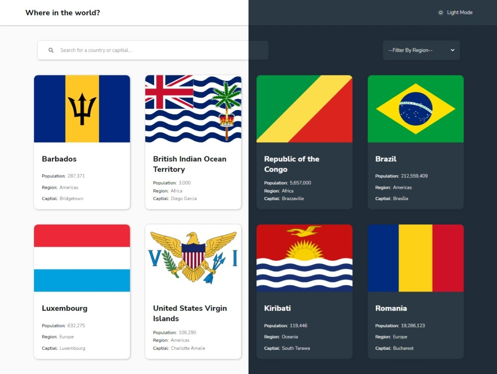
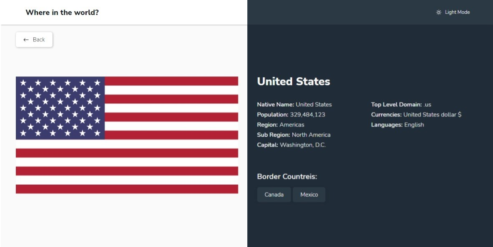

# Frontend Mentor - REST Countries API with color theme switcher solution

This is a solution to the [REST Countries API with color theme switcher challenge on Frontend Mentor](https://www.frontendmentor.io/challenges/rest-countries-api-with-color-theme-switcher-5cacc469fec04111f7b848ca).

Frontend Mentor challenges help you improve your coding skills by building realistic projects.

## Table of contents

-   [Overview](#overview)
    -   [The challenge](#the-challenge)
    -   [Screenshot](#screenshot)
    -   [Links](#links)
-   [My process](#my-process)
    -   [Built with](#built-with)
    -   [What I learned](#what-i-learned)
    -   [Useful resources](#useful-resources)

## Overview

### The challenge

Users should be able to:

-   See all countries from the API on the homepage
-   Search for a country using an `input` field
-   Filter countries by region
-   Click on a country to see more detailed information on a separate page
-   Click through to the border countries on the detail page
-   Toggle the color scheme between light and dark mode _(optional)_

### Screenshot

-   Home page



-   Detail page



### Links

-   Solution URL: [Fontend mentor solution]()
-   Live Site URL: [Live site]()

## My process

### Built with

-   Semantic HTML5 markup
-   CSS custom properties
-   Flexbox
-   CSS Grid
-   Mobile-first workflow
-   [React](https://reactjs.org/) - JS library
-   [React Router](https://reactrouter.com/en/main) - React library
-   [React Query](https://react-query-v3.tanstack.com/) - React library
-   [Styled Components](https://styled-components.com/) - For styles
-   [Rest Countries API](https://restcountries.com/) - API

### What I learned

-   Use RegExp make population number seperate with comma every three digits.

```js
const regExp = /\B(?=(\d{3})+(?!\d))/g;
const population = data.population.toString().replace(regExp, ","),
```

-   Use React Query to manage fetch status.

```js
export const useGetCountries = (value) => {
    return useQuery(["countries", value], () => fetchCountries(value));
};
```

### Useful resources

-   [node-i18n-iso-countries](https://github.com/michaelwittig/node-i18n-iso-countries) - This library help me to translate countries code Alpha-3 to countries name.
