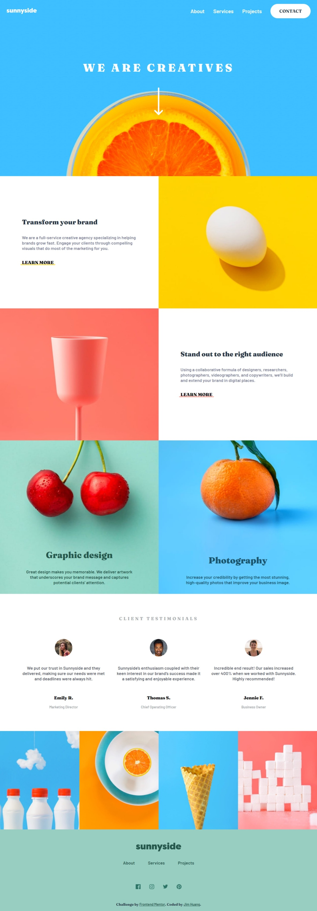

# Frontend Mentor - Shortly URL shortening API Challenge solution

This is a solution to the [Shortly URL shortening API Challenge challenge on Frontend Mentor](https://www.frontendmentor.io/challenges/url-shortening-api-landing-page-2ce3ob-G).

Frontend Mentor challenges help you improve your coding skills by building realistic projects.

## Table of contents

-   [Overview](#overview)
    -   [The challenge](#the-challenge)
    -   [Screenshot](#screenshot)
    -   [Links](#links)
-   [My process](#my-process)
    -   [Built with](#built-with)
    -   [What I learned](#what-i-learned)

## Overview

### The challenge

Users should be able to:

-   View the optimal layout for the site depending on their device's screen size
-   Shorten any valid URL
-   See a list of their shortened links, even after refreshing the browser
-   Copy the shortened link to their clipboard in a single click
-   Receive an error message when the `form` is submitted if:
    -   The `input` field is empty

### Screenshot

Desktop



Mobile


### Links

-   Solution URL: [fontend mentor solution](https://www.frontendmentor.io/solutions/use-scss-and-bem-for-css-use-localstorage-to-save-the-generator-url-41iVVLWQF8)
-   Live Site URL: [live site](https://jim-url-shortening-api-master.netlify.app/)

## My process

### Built with

-   SCSS
-   Flexbox
-   Mobile-first workflow
-   BEM methodology
-   LocalStorage

### What I learned

Use SCSS `@mixin` to RWD.

```scss
@mixin respond($media) {
    @if $media == desktop {
        @media (min-width: 768px) {
            @content;
        }
    }
}
```

Use naviagtor API to copy the words.

```js
navigator.clipboard.writeText(url).then(() => {
    alert("Copy successful");
});
```
