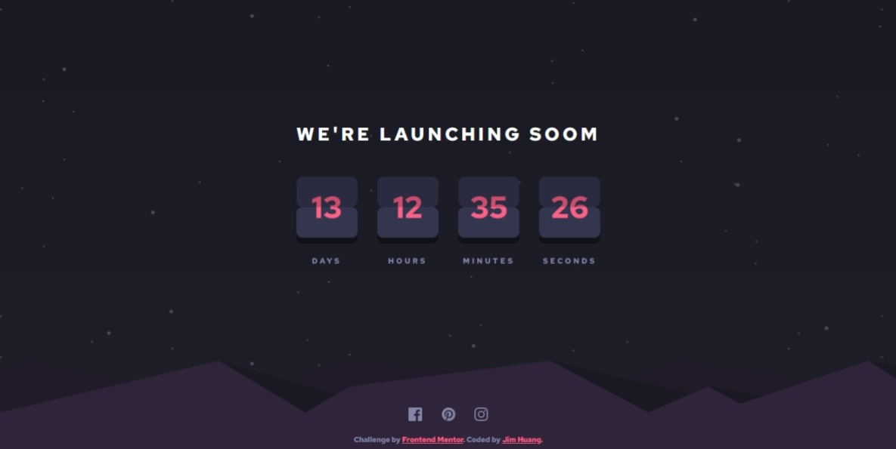

# Frontend Mentor - Job listings with filtering solution

This is a solution to the [Job listings with filtering challenge on Frontend Mentor](https://www.frontendmentor.io/challenges/job-listings-with-filtering-ivstIPCt).

Frontend Mentor challenges help you improve your coding skills by building realistic projects.

## Table of contents

-   [Overview](#overview)
    -   [The challenge](#the-challenge)
    -   [Screenshot](#screenshot)
    -   [Links](#links)
-   [My process](#my-process)
    -   [Built with](#built-with)
    -   [What I learned](#what-i-learned)

## Overview

### The challenge

Users should be able to:

-   View the optimal layout for the site depending on their device's screen size
-   See hover states for all interactive elements on the page
-   Filter job listings based on the categories

### Screenshot

-   Mobile


-   Desktop



### Links

-   Solution URL: [Fontend mentor solution]()
-   Live Site URL: [Live site]()

## My process

### Built with

-   Flexbox
-   Mobile-first workflow
-   [React](https://reactjs.org/) - JS library
-   [Styled Components](https://styled-components.com/) - For styles

### What I learned

Learn Styled Components.

-   Basics

```js
const Container = styled.div`
    height: 20rem;
    width: 100%;
    border-radius: 1rem;
    background: #eee;
    h1 {
        color: #000;
    }
`;

function App() {
    return (
        <Container>
            <h1>Hello World !</h1>
        </Container>
    );
}
```

-   Theme Provider

```js
import { ThemeProvider } from "styled-components";

const Container = styled.div`
    height: 20rem;
    width: 100%;
    border-radius: 1rem;
    background: #eee;
    h1 {
        color: ${(props) => props.theme.colors.main};
    }
`;

const theme = {
    colors: {
        main: "red",
    },
};

function App() {
    return (
        <ThemeProvider theme={theme}>
            {" "}
            // Wrap all component
            <Container>
                <h1>Hello World !</h1>
            </Container>
        </ThemeProvider>
    );
}
```

-   Global Style

```js
import { createGlobalStyle } from "styled-components";

const GlobalStyles = createGlobalStyle`
    html{
        font-size: 62.5%;
    }
    *{
        box-sizing: border-box;
        font-family: 'League Spartan', sans-serif;
        font-size: 1.5rem;
        margin:0;
        padding:0;
    }
`;
function App() {
    return (
        <ThemeProvider theme={theme}>
            <GlobalStyles /> // Add at the first
            <Container>
                <h1>Hello World !</h1>
            </Container>
        </ThemeProvider>
    );
}
```
